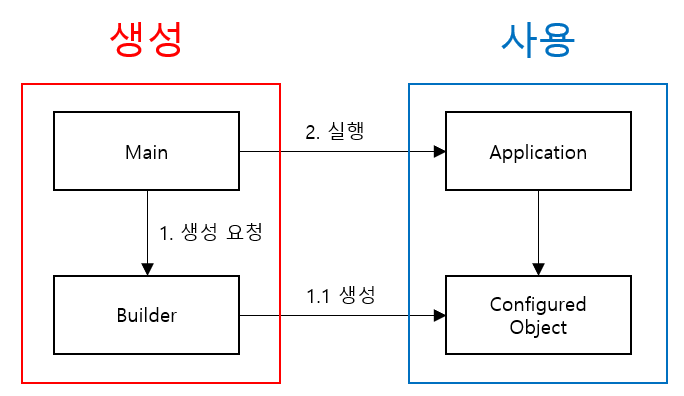
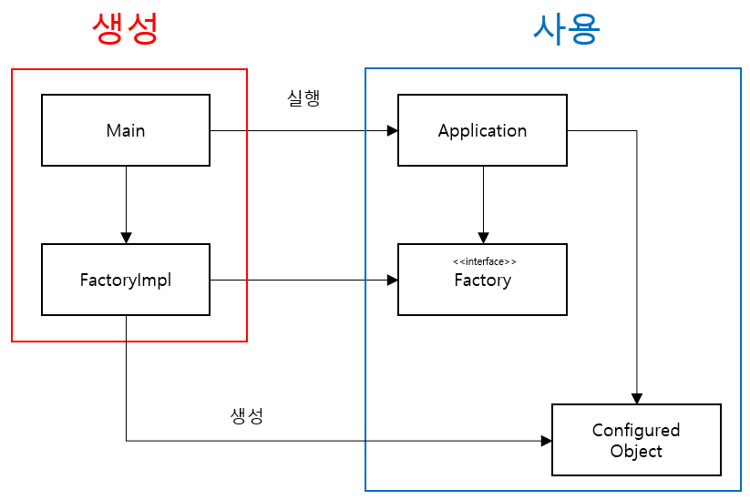
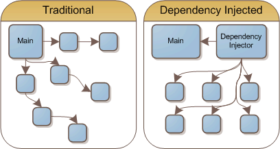

# 11장. 시스템

## 시스템 제작과 시스템 사용을 분리하라.
체계적이고 탄탄한 시스템을 만들고 싶다면, 흔히 쓰는 좀스럽고 손쉬운 기법으로 모듈성을 깨서는 절대로 안된다.  <br>
```java
public Service getService() {
    if(service == null) {
        service = new MyServiceImpl(...);    
    }    
    return service;
}
```
위 코드는 초기화 지연이라는 기법이다. <br>
위 기법은 장점은 여러가지다. 
- 실제로 필요할 때까지 객체를 생성하지 않으므로 불 필요한 부하가 걸리지 않는다.
- 어떤 경우에도 null 포인터를 반환하지 않는다.

여러가지 단점도 존재한다.
- 위 메서드에서 생략한 생성자 인수에 명시적으로 의존하게 됨. 따라서, 런타임 로직에서 MyServiceImpl 객체를 사용하지 않더라도 의존성을 해결하지 않는다면, 컴파일이 안됨.
- 테스트 문제 1) MyServiceImpl 이 무거운 객체라면? 단위테스트에 getService 메서드를 호출하기 전에 적절한 테스트 전용 객체를 service 필드에 할당해야한다.
- 테스트 문제 2) 런타임 로직에다 객체 생성 로직을 섞어 놓아, service 가 null 일 경우와 아닐 경우를 다 테스트를 해야함.
- 즉, SRP 를 깬다.
- 또한 저 Impl 객체가 모든상황에서 필요할까? 고민을 해야한다.

위 같은 코드를 한 번 정도 사용한다면 심각하진 않다. 하지만, 수시로 사용한다면 문제가 된다.<br>

> 설정 논리는 일반 실행 논리와 분리해야 모듈성이 높아진다. 또한 주요 의존성을 해소하기 위한 방식, 즉 전반적이며 일관적인 방식도 필요하다.

### *Main 분리*
생성과 관련한 코드는 모두 main 이나 main 이 호출하는 모듈로 옮기고, 나머지 시스템은 모든 객체가 생성되었고 모든 의존성이 연결되었다고 가정한다. <br>



*제어 흐름*
- main 함수에서 시스템에 필요한 객체를 생성훈 후 이를 애플리케이션에 넘긴다.
- 애플리케이션은 그저 객체를 사용할 뿐이다.

제어흐름을 보면, 애플리케이션은 main 이나 객체가 생성되는 과정을 전혀 모른다.

### *팩토리*
때로는 객체가 생성되는 시점을 애플리케이션이 결정할 필요도 생긴다.
아래와 같이 ABSTRACT FACTORY 패턴을 이용하여 처리한다. 



*제어 흐름*
- 모든 의존성은 main 에서 애플리케이션으로 향한다
- 애플리케이션은 구현 객체이 생성되는 구체적인 방법을 모른다.
- 객체가 생성되는 과정은 main 쪽 FactoryImpl 이 알고 있다.
- 그럼에도 애플리케이션은 구현 객체의 인스턴스가 생성되는 시점을 완벽하게 통제한다.

### *의존성 주입*
사용과 제작을 분리하는 강력한 메커니즘 하나가 의존성 주입이다. <br>
의존성 주입은 제어 역전 기법을 의존성 관리에 적용한 메커니즘이다. <br>
제어 역전에서는 한 객체가 맡은 보조 책임을 새로운 객체에 전적으로 떠넘긴다. <br>
넘겨 받은 새로운 객체는 해당 책임만 맡으므로 SRP 원칙을 지키게 된다.



## 확장
소프트웨어 시스템은 물리적인 시스템과 다르다. 관심사를 적절히 분리해 관리한다면 소프트웨어 아키텍처는 점진적을 발전할 수 있다. <br>

### 관점 지향 프로그래밍 AOP(Aspect-Oriented Programming)


관점 지향 프로그래밍은 트랜잭션, 로깅, 보안코드를 횡단 관심사로 분류해서 관점(aspect)로 관리하는 방법을 말한다. <br>
관점으로 분류해서 코드를 관리한다면 다른 다른 코드에 영향을 미치지 않고 해당 관점 코드만 변경 가능하다. <br>
많은 관심사들을 분리해서 처리를 하는 것이 효율적이다.<br>


*횡단 관심사 분리의 필요성* 

[ 예시 코드 ]
```java
public Response excuteBusinessLogic(Request request) {
    // 공통 기능
    checkAuth(request);
    
    // 비즈니스 로직
    Response response = businessLogin(userName, message);
    
    // 공통 기능
    logging(response)
}
```

위 코드를 횡단 관심사 분리를 적용하여, 비즈니스 로직만 구현을 한다면
```java
public Response excuteBusinessLogic(Request request){
        // 비즈니스 로직
        Response response = businessLogin(userName, message);
}

// 공통 코드는 별도의 코드에서 관리
```
위와 같은 코드로 작성할 수가 있다. <br>

이젠 자바에서 사용하는 관점 혹은 관점과 유사한 메커니즘을 살펴보자.

## 자바 프록시
모델과 로직을 분리한 코드를 작성할 수 있기 때문에 자바 프록시를 쓸 수 있다 <br>
하지만, 코드에 복잡성이 아직 있어서 현재는 많이 사용하진 않는다.

## 순수 자바 AOP 프레임워크
자바 프록시보다는 조금 진화된 메커니즘이다. 내부적으로 순수 자바 관점을 구현하는 스프링 AOP, JBoss AOP 등과 같은 여러 자바 프레임워크가 프록시를 사용한다. <br>
실제로 개발자가 이러한 프레임워크를 사용하는 관점에서 훨씬 더 편하게 사용할 수 있도록 바뀌었다. <br>

```xml
<beans>
    ...
    <bean id="appDataSource"
          class="org.apache.commons.dbcp.BasicDataSource"
          destroy-method="close"
          p:driverClassName="com.mysql.jdbc.Driver"
          p:url="jdbc:mysql://localhost:3306/mydb"
          p:username="me"/>

    <bean id="bankDataAccessObject"
          class="com.example.banking.persistence.BankDataAccessObject"
          p:dataSource-ref="appDataSource"/>

    <bean id="bank"
          class="com.example.banking.model.Bank"
          p:dataAccessObject-ref="bankDataAccessObject"/>
    ...
</beans>
```

위 코드는 스프링 설정파일 app.xml 일부로 아주 전형적인 모습이다. <br>

애플리케이션에서 DI 컨테이너에게 (XML 파일에 명시된) 시스템 내 최상위 객체를 요청하려면 다음과 같은 코드가 필요하다.
```java
XmlBeanFactory bf = new XmlBeanFactory(new ClassPathResource("app.xml", getClass()));
Bank bank = (Bank) bf.getBean("bank");
```

> XML 은 장황하고 읽기 어렵다는 문제가 있음에도 불구하고, 이런 설정 파일에 명시된 '정책'이 겉으로 보이지 않지만, 자동으로 생성되는 프록시나 관점 논리보다 단순하다.

## AspectJ 관점
관심사를 관점으로 분리하는 가장 강력한 도구는 AspectJ 언어이다. 이 관점은 언어 차원에서 관점을 모듈화 구성으로 지원하는 자바 언어 확장이다. <br>
<br>
관점을 분리하는 강력하고 풍부한 도구 집합을 제공하지만, 새 도구를 사용하고 새 언어 문법과 사용법을 익혀야한다는 단점이 있다.

## 결론
시스템 역시 깨끗해야 한다.
- 깨끗하지 못한 아키텍처는 도메인 논리를 흐리며 기민성이 떨어진다
- 도메인 논리가 흐려지면 제품 품질이 떨어진다.
- 그로인해 버그가 숨어들기 쉬워지고,
- 스토리 구현하기 어려워진다.
- 또한 기민성이 떨어지면 생산성이 낮아져 TDD 제공하는 장점이 사라진다.

고로, 추상화 단계에서 의도는 명확히 표현해야한다. 그러려면 POJO를 작성하고 관점 혹은 관점과 유사한 메커니즘을 사용해 각 구현 관심사를 분리해야 한다.
