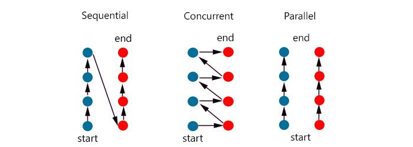
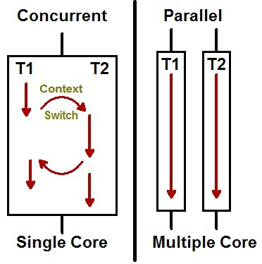

# 13장. 동시성
## 1) 동시성 프로그래밍 이란?
- 애플리케이션을 효율적으로 실행하기 위해 멀티코어를 온전히 활용하도록 구현하는 방식
- 외부 서비스의 응답을 기다리면서 아무일도 하지 않으면 CPU 사이클이 낭비된다.
- 동시성은 결합을 없내는 전략이다.
- 즉, 무엇과 언제를 분리하는 전략이다 (스레드가 하나인 프로그램은 무엇과 언제가 서로 밀접하다.)
- 흔히 단일 스레드 프로그램을 디버깅하는 프로그래머는 break point 를 정한 후, 어느 정지점에서 걸렸는지 살펴보면서 시스템 상태를 파악할 수 있다.
- 어떤 시스템은 응답 ₩시간과 작업 처리량 개선이라는 요구사항으로 인해 직접적인 동시성 구현이 불가피한 경우가 있다.

### 1-1) 동시성 프로그래밍이 왜 필요한가?
무어의 법칙은 발열과 경제성 문제가 더해지면서 한계를 보이기 시작하였다. <br>
그 한계를 극복하기 위해서 멀티 코어 프로세서가 등장했다. <br>
하지만, 멀티 코어를 잘 활용하는 건 쉽지 않다. <br>

|동시성 (Concurrency)|병렬성 (Parallelism)|
|------------------|-------------------|
|동시에 실행되는 것처럼 보이는 것|실제로 동시에 실행되는 것|
|소프트웨어적 성질(싱글코어도 가능)|하드웨어적 성질 (싱글코어는 불가능)|
|한번에 여러 일을 다룸|한 번에 여러 일을 처리|
|논리적 개념|물리적 개념|





위 사진은 싱글코어와 멀티코어로 비교한 그림이다. 싱글코어는 2개의 작업을 동시에 살행되는 것처럼 보이기 위해 번갈아가며 작업을 수행 <br>
다른 작업으로 바꾸어 실행할 때 내부족으로 Context switch 가 발생

### 1-2) 무엇과 언제를 분리하면, 애플리케이션 구조와 효율이 극적으로 나아진다.
- 구조적인 관점에서 프로그램은 거대한 루프 하나가 아니라 작은 협력 프로그램 여럿으로 보이게 된다.

### 1-3) 동시성 프로그래밍에 대한 오해
**1. 동시성은 항상 성능을 높여준다.**<br>

그렇지만 그렇지 않다. 
- 동시성은 때로 성능을 높여준다. 
- 대기 시간이 아주 길어 여러 스레드가 프로세서를 공유할 수 있거나, 여러 프로세서가 동시에 처리할 독립적인 계산이 충분히 많은 경우에만 성능이 높아진다.

**2. 동시성을 구현해도 설계는 변하지 않는다.**<br>
- 단일 스레드 시스템과 다중 스레드 시스템은 설계가 판이하게 다르다. 
- 일반적으로 무엇과 언제를 분리하면 시스템 구조가 크게 달라진다.

**3. 웹 또는 EJB 컨테이너를 사용하면 동시성을 이해할 필요가 없다.**<br>
- 실제로 컨테이너가 어떻게 동작하는지, 어떻게 동시 수정, 데드락 등과 같은 문제를 피할 수 있는 지를 알아야만 한다.

### 1-4) 동시성 타당한 생각
**1. 동시성은 다소 부하를 유발한다.**<br>
성능 측면에서 부하가 걸리며, 코드도 더 짜야한다.

**2. 동시성은 복잡하다.**<br>
간단한 문제라도 동시성은 복잡하다.

**3. 일반적으로 동시성 버그는 재현하기 어렵다.**<br>
그래서 진짜 결함으로 간주되지 않고 일회성 문제로 여겨 무시하기 쉽다.

**4. 동시성을 구현하려면 흔히 근본적인 설계 전략을 재고해야 한다.**<br>


### 1-5) 동시성을 구현하기 어려운 이유는 무엇일까?
- 객체 하나를 공유한 후 동일 필드를 수정하던 두 스레드가 서로 간섭하므로 예상치 못한 결과(문제)를 내놓는다. 이를 레이스 컨디션(race condition) 이라고 한다.

>
>#### 레이스 컨디션이란?
>경합 상태라고 불리며, 여러 프로세스가 동시에 공유하는 자원에 접근함에 따라 일어나는 예상치 않은 이상이나 상태를 의미한다. <br>
>동시성 프로그래밍에서는 이 레이스 컨디션을 일으키지 않고 올바르게 프로그래밍을 하는 것이 중요한 문제다.
> 
> 
> 
> 위에서 레이스 컨디션을 일으키는 부분을 크리티컬 섹션(critical section) 이라고 하며, 크리티컬 섹션을 보호하기 위해서는 동기 처리구조를 이용해야 한다.


### 1-6) 동시성 방어 원칙
**1. 단일 책임 원칙**<br>

동시성 코드는 다른코드와 분리해서 작성하라
  - 동시성 코드는 독자적인 개발, 변경, 조율 주기가 있다.
  - 동시성 코드에는 독자적인 난관이 있다. 다른 코드에서 겪는 난관가 다르며 훨씬 어렵다.
  
**2. 자료범위를 제한하기**<br>

공유 자료를 수정하는 위치가 많을수록 문제의 가능성이 커진다. 따라서 어려운 버그가 더욱 찾기 어려워진다. 공유 객체를 사용하는 코드 내 임계영역을 synchronized 키워드로 보호하자
- 자료 사본을 사용하라 : 공유 자료를 줄이려면 처음부터 공유하지 않는 방법이 제일 좋다. 하지만 공유하게 될 경우엔, 객체를 복사해 읽기 전용으로 사용하거나, 각 스레드가 객체를 복사해 사용한 후 한 스레드가 해당 사본에서 결과를 가져오는 방법도 가능하다.
- 스레드는 가능한 독립적으로 구현하라 : 각 스레드는 클라이언트 요청 하나를 처리한다. 그러면 다른 스레드와 동기화할 필요가 없으므로 세상에 자신만 있는 듯 돌아갈 수 있다.

## 2) 라이브러리를 이해하라 (추후 공부 예정)
```java
java.util.concurrent
java.util.concurrent.atomic
java.util.concurrent.locks
```

- 스레드 환경에 안전한 컬렉션(Thread Safe)을 사용한다.
- 서로 무관한 작업을 수행할 때는 executor 프레임워크를 사용한다.
- 가능하다면 스레드가 차단(blocking)되지 않는 방법을 사용한다.
- 일부 클래스 라이브러리는 스레드에 안전하지 못하다.

### 2-1) 스레드 환경에 안전한 컬렉션
- ReentranLock : 한 메서드에서 잠그고 다른 메서드에서 푸는 락(lock)이다.
- Semaphore : 전형적인 세마포다. 개수가 있는 락이다.
- CountDownLatch : 지정한 수만큼 이벤트가 발생하고 나서야 대기 중인 스레드를 모두 해제하는 락이다. 모든 스레드에게 동시에 공평하게 시작할 기회를 준다.

## 3) 실행 모델을 이해하라. (추후 디자인 패턴에 대해서 공부 예정)
다중 스레드 애플리케이션 분류하는 방식
- Producer-Consumer (생산자-소비자) Pattern: 생산자 스레드와 소비자 스레드 둘 다 진행 가능함에도 불구하고 동시에 서로에게서 시그널을 기다릴 가능성이 존재하는 경우 해법이 필요
- Readers-Writers (읽기-쓰기) Pattern: 읽기 쓰레드와 쓰기 쓰레드 균형을 잡으면서 동시 갱신 문제를 피하는 해법이 필요
- Dining Philosophers (식사하는 철학자들) Pattern: 기업 애플리케이션은 여러 프로세스가 자원을 얻으려 경쟁한다. 주의해서 설계하지 않으면 데드락, 라이브락, 처리율 저하, 효율성 저하 등을 겪으니 해법이 필요하다.


> **식사하는 철학자들**<br>
> 5명의 철학자가 원탁에 앉ㄷ아있고, 스파게티가 있다. 양 옆에 포크가 하나씩 있는데, 각 철학자는 스파게티를 먹으려면 포크 2개를 사용해야 하며,
> 다른 철학자에게 말을 걸 수 없고, 포크를 빼앗을 수 없다.
> 
> 이 상황에서 철학자들이 동시에 오른쪽 포크를 집는다면? (철학자 : 프로세스,  포크 : 자원)
> 
> 철학자들은 포크를 공유할 수 없다.(상호 배제) <br>
> 자신의 왼쪽에 앉은 철학자가 포크를 놓을 때까지 기다린다 (점유상태로 대기) <br>
> 철학자들은 왼쪽 철학자의 포크를 빼앗을 방법도 없다. (선점 불가) <br>
> 철학자들은 자신의 왼쪽 철학자의 포크를 대기한다 (순환대기)

일상에서 접하는 대다수 다중 스레드 문제는 위에서 언급한 세 범주 중 하나에 속한다.<br>
따라서, 각 알고리즘을 공부하고 해법을 고민해보자.

## 4) 동기화하는 메서드 사이에 존재하는 의존성을 이해하라 (3 가지 방법)

공유 객체 하나에 메서드 하나만 사용하라.

### Client
```java
// 공유 자료
IntegerIterator iterator = new IntegerIterator();

// Thread에서 호출되는 코드
while (iterator.hasNext()) {
    int nextValue = iterator.next();
}
```

### Server
```java
public class IntegerIterator implements Iterator<Integer> {
    private Integer nextValue = 0;
    
    public synchronized boolean hasnNext() {
        return nextValue < 100000;
    }
    
    public synchronized Integer next() {
        if(nextValue == 100000) {
            throw new IteratorPastEndException();
        }
        
        return nextValue++;
    }
    
    public synchronized Integer getNextValue() {
        return nextValue;
    }
}
```
> Thread1 이 hasNext() true 를 받았으나, 잠시 다른일에 선점을당한다. <br>
> Thread2 가 hasNext() ture 를 받고 next()를 호출한다.<br>
> Thread1 이 실행을 재개하여 next() 를 또 호출한다.

만약, 메서드 하나 이상 사용할 경우에 주의해야한다.


  - 클라이언트에서 잠금 : 클라이언트에서 첫 번째 메서드를 호출하기 전에 서버를 잠근다. 마지막 메서드를 호출할 때까지 잠금을 유지한다.
    - ```java
         // 공유 자료
         IntegerIterator iterator = new IntegerIterator();
  
         // Thread에서 호출되는 코드
         while (true) {
             int nextValue;
             synchronized(iterator) { // 임계영역 설정 한 스레드만 접근가능.
                if(!iterator.hasNext()) {
                    break;
                }
                nextValue = iterator.next();
             }
             doSomtingWith(nextValue);
         }
      
      클라이언트에서 락을 걸어 Thread Safe 하게 블록을 보호한다.
      자원을 사용하는 클라이언트마다 위의 처리를 해줘야하므로 비효울적이다.
      ```
  - 서버에서 잠금 : 서버에다 "서버를 잡그고 모든 메서드를 호출한 후 잠금을 해제" 하는 메서드를 구현한다. 클라이언트는 이 메서드를 호출
    - ```java
      #Client
         // 공유 자료
         IntegerIterator iterator = new IntegerIterator();
  
         // Thread에서 호출되는 코드
         while (true) {
            Integer nextValue = iterator.getNextOrNull();
            if(next == null) break;
         }
      
      #Server
      public class IntegerIteratorServerLocked {
            private Integer nextValue = 0;
            
            public synchronized Integer getNextOrNull() {
                if(nextValue < 100000) {
                    return nextValue++;
                }else {
                    return null;
                }
            }     
      }
      서버에서 두 개로 나눠졌던 동작을 하나로 합쳐서 락을 건다.
      클라이언트에서는 보호된 메서드로 호출하기만 하면 된다.
      ```
  - 연결 서버 : 잠금을 수행하는 중간 단계(adapter)를 생성  '서버에서 잠금' 방식과 유사하지만 원래 서버는 변경하지 않는다.
    - ```java
      #Client
         // 공유 자료
         IntegerIterator iterator = new IntegerIterator();
  
         // Thread에서 호출되는 코드
         while (true) {
            Integer nextValue = iterator.getNextOrNull();
            if(next == null) break;
         }
      
      # Adapter
      public class ThreadSafeIntegerIterator {
            private IntegerIterator iterator = new IntegerIterator();
            
            public synchronized Integer getNextOrNull() {
                if(iterator.hasNext()) 
                    return iterator.next();
      
                return null;
            } 
      }
      
      어댑터에서 서버가 두개로 나줘졌던 동작을 하나로 합쳐서 락을 건다.
      클라이언트에는 보호된 메서드를 호출하기만 하면 된다.
      * 서버의 코드가 외부 코드라서 수정할 수 없을 때 우리코드에서 Adapter 만들어서 사용한다.
      ```


## 5) 동기화 하는 부분을 작게만들어라
자바에서 synchronized 키워드를 사용하면 락을 설정할 수 있다. 하지만, 락은 스레드를 지연시키고 부하를 가중시킨다.<br>
따라서 해당 키워드를 남발하지말자. <br>
임계영역을 보호하되, 임계영역 수를 최대한 줄여라.<br>
그렇다고 임계영역을 거대하게 만들지 말자. 그렇게되면 스레드 간에 경쟁이 늘어나고 프로그램 성능이 저하된다.

## 6) 올바른 종료 코드는 구현하기 어렵다. (동시성 프로그래밍 하는 방법을 추후 공부 예정)
종료 코드를 개발 초기부터 고민하고 동작하게 초기부터 구현하라. <br>
생각보다 오래걸리고 어렵다. 따라서 이미 나온 알고리즘을 검토하라

## 7) 스레드 코드 테스트하기
테스를 했다고 코드가 올바르다고 증명하기 현실적으로 어렵다. 테스트가 정확성을 보장하진 않지만 위험을 낮춘다.<br>
따라서, 
- 문제를 노출하는 테스트 케이스르 작성해라.
- 프로그램 설정과 시스템 설정과 부하를 바꿔가며 자주 돌려라
- 테스트가 실패하면 원인을 추적하라
- 다시 돌렸더니 통과한다는 이유로 그냥 넘어가면 절대 안된다.

### 7-1) 코드에 보조 코드를 넣기 (대체로 되는데? 가끔 안되는 경우)
드물게 발생하는 오류를 자주 발생시키도록 보조 코드를 추가한다.

- 코드에 wait(), sleep(), yield(), priority() 함수를 추가해 직접 구현한다.
- 보조 코드를 넣어주는 도구를 사용해 테스트한다.
  - 다양ㅇ한 위치에 ThreadJigglePoint.jiggle()을 추가해 무작위로 sleep(), yield()가 호출되도록한다.
- 테스트 환경에서 보조 코드를 돌려본다.

### 7-2) 동시성 코드를 실제환경이나 테스트 환경에서 돌려본다.
다양한 요청과 상황에 동시성 코드가 정상적으로 동작하는지 확인한다.

- 배포하기 전에는 테스트 환경에서 충분히 오랜시간 검증한다.
- 동시성 코드를 배포한 후에 모니터링을 통해 문제가 발생하는지 지켜본다.

### 7-3) 고려사항
- 말이 안 되는 실패는 잠정적인 스레드 문제로 취급하라.
- 다중 스레드를 고려하지 않는 순차 코드부터 제대로 돌게 만들자.
- 다중 스레드를 쓰는 코드 부분을 다양한 환경에 쉽게 끼워 넣을 수 있도록 스레드 코드를 구현하라
- 다중 스레드를 쓰는 코드 부분을 상황에 맞춰 조정할 수 있게 작성하라
- 프로세서 수보다 많은 스레드를 돌려보라.
- 다른 플랫폼에서 돌려보라.
- 코드에 보조코드를 넣어 돌려라. 강제로 실패를 일으켜보라.


