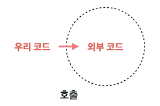

## 8장. 경계
모든 소프투에어를 직접 개발하는 경우는 드물다.<br> 
어떤 식으로든 이 외부 코드를 우리 코드에 깔끔하게 통합해야만 한다.<br>
이번 장에선 소프트웨어 경계를 깔끔하게 처리하는 기법과 기교를 살펴본다.


> ### *외부 코드 사용하기*

인터페이스 제공자와 인터페이스 사용자 사이에 특유의 긴장이 존재한다.
패키지 제공자나 프레임워크 제공자는 적용성을 최대한 넓히려 애쓴다. 더 많은 환경에서 돌아가야 더 많은 고객이 구매하니까. <br>
반면, 사용자는 자신의 요구에 집중하는 인터페이스를 바란다. <br>
위 같은 긴장으로 인해 시스템 경계에서 문제가 생길 소지가 많다.

<span style="color : red">
예시)  java.util.Map 
</span>

보통 Sensor 라는 객체를 담는 Map을 만든다면?
```java
Map sensors = new HashMap();
...
Sensor s = (Sensor) sensors.get(sensorId);
```
위 같은 코드가 한 번이 아니라 여러 차례가 나온다. <br>
즉 Map이 반환하는 Object 를 올바른 유형으로 변환할 책임은 Map을 사용하는 클라이언트에 있다.

위같은 코드는 의도도 분명히 드러나지 않다.

```java
Map<String, Sensor> sensors = new HashMap<Sensor>();
...
Sensor s = sensor.get(sensorId);
```
- Map 인터페이스가 제공하는 clear 등 불필요한 기능이 노출됨.
- 외부 코드가 함부로 호출하면 sensor 데이터가 손상될 수도 있음

```java
public class Sensors {
    private Map sensors = new HashMap(); // private 하게 데이터 감추기
    
    // 이 메서드만 사용.
    public Sensors getById(String id) {
        return (Sensors) sensors.get(id);
    }
}
```
- 캡슐화를 통해 Map 을 감춘다.
- 원하는 기능만 공개할 수 있다.
- 적절한 경계로 우리 코드를 보호할 수 있다.


> ### *경계 살피고 익히기*



짐 뉴커크가 말한 <span style="color : green"> 학습 테스트</span> 라는 게 있다. <br>
우리 쪽 코드를 작성해 외부 코드를 호출하는 대신 먼저 간단한 테스트 케이스를 작성해 외부 코드를 익히는 방법이다. <br>

우리는 타사 라이브러리를 가져다 쓰는 경우가 많다. <br>
대개 버그가 발생 했을 시, 우리 쪽 코드 문제인지? 라이브러리 문제인지 찾기 위해 오랜 디버깅으로 골치를 앓는다. <br>

그래서, 외부코드를 통합하기도 어렵고 외부 코드를 어려우니 <span style="color : green">학습 테스트을 통해 API를 제대로 이해하는 지를 확인하자.</span>


> ### *log4j 익히기*
로거 클래스를 캡슐화하여 사용하자.


>### *Learning Test 는 꽁짜 이상이다.*
Learning Test 에 드는 비용은 없다 또한, 투자하는 노력보다 얻는 성과가 크다. <br>


패키지 새 버전이 나온다면 학습 테스트를 돌려 차이 여부를 파악한다. 
패키지 작성자는 버그를 수정하고 기능도 추가한다. 그리하여 새로운 버전이 나올 때마다 새로운 위험이 생긴다. <br>


<span style = "color : green">새 버전이 우리 코드와 호환되지 않으면 Learning Test 가 이 사실을 곧바로 밝혀낸다.</span>

Learning Test 를 이용한 학습이 필요하든 그렇지 않든, 실제 코드와 동일한 방식으로 인터페이스를 사용하는 테스트 케이스가 필요하다.

이런 경계 테스트가 있다면 패키지의 새 버전으로 이전하기도 쉬워지고, 

낡은 버전을 필요 이상으로 오랫동안 사용하려는 유혹에 빠지기 쉽다.

<span style ="color : blue">하지만 실무에서 무조건 쓸 필요는 없다. 작성을 해두면 좋지만, 다른일들이 많다보니 Learning Test 를 고려해서 작성해두면 좋을 거 같다.<span>

> ### *아직 존재하지 않는 코드를 사용하기*


외부코드와 호환하기 - Adapter 패턴

외부 코드를 호출할 때, 우리가 정의한 인터페이스 대로 호출하기 위해 사용하는 패턴

아래에는 오픈소스인 elasticsearch 에 있는 소스로 예제 보기

<span style = "color :red; font-size : 16pt">Adapter Code</span>
```java
package org.elasticsearch.http.nio;

import io.netty.buffer.ByteBuf;
import io.netty.buffer.Unpooled;
import io.netty.channel.ChannelFuture;
import io.netty.channel.ChannelHandler;
import io.netty.channel.ChannelHandlerContext;
import io.netty.channel.ChannelOutboundHandlerAdapter;
import io.netty.channel.ChannelPromise;
import io.netty.channel.embedded.EmbeddedChannel;

import org.elasticsearch.ExceptionsHelper;
import org.elasticsearch.nio.FlushOperation;
import org.elasticsearch.nio.Page;
import org.elasticsearch.nio.WriteOperation;

import java.nio.ByteBuffer;
import java.util.LinkedList;
import java.util.function.BiConsumer;

class NettyAdaptor {

    private final EmbeddedChannel nettyChannel;
    private final LinkedList<FlushOperation> flushOperations = new LinkedList<>();

    NettyAdaptor(ChannelHandler... handlers) {
        nettyChannel = new EmbeddedChannel();
        nettyChannel.pipeline().addLast("write_captor", new ChannelOutboundHandlerAdapter() {

            @Override
            public void write(ChannelHandlerContext ctx, Object msg, ChannelPromise promise) {
                // This is a little tricky. The embedded channel will complete the promise once it writes the message
                // to its outbound buffer. We do not want to complete the promise until the message is sent. So we
                // intercept the promise and pass a different promise back to the rest of the pipeline.

                try {
                    ByteBuf message = (ByteBuf) msg;
                    promise.addListener((f) -> message.release());
                    NettyListener listener = NettyListener.fromChannelPromise(promise);
                    flushOperations.add(new FlushOperation(message.nioBuffers(), listener));
                } catch (Exception e) {
                    promise.setFailure(e);
                }
            }
        });
        nettyChannel.pipeline().addLast(handlers);
    }

    public void close() throws Exception {
        assert flushOperations.isEmpty() : "Should close outbound operations before calling close";

        ChannelFuture closeFuture = nettyChannel.close();
        // This should be safe as we are not a real network channel
        closeFuture.await();
        if (closeFuture.isSuccess() == false) {
            Throwable cause = closeFuture.cause();
            ExceptionsHelper.maybeDieOnAnotherThread(cause);
            throw (Exception) cause;
        }
    }

    public void addCloseListener(BiConsumer<Void, Exception> listener) {
        nettyChannel.closeFuture().addListener(f -> {
            if (f.isSuccess()) {
                listener.accept(null, null);
            } else {
                final Throwable cause = f.cause();
                ExceptionsHelper.maybeDieOnAnotherThread(cause);
                assert cause instanceof Exception;
                listener.accept(null, (Exception) cause);
            }
        });
    }

    public int read(ByteBuffer[] buffers) {
        ByteBuf byteBuf = Unpooled.wrappedBuffer(buffers);
        int initialReaderIndex = byteBuf.readerIndex();
        nettyChannel.writeInbound(byteBuf);
        return byteBuf.readerIndex() - initialReaderIndex;
    }

    public int read(Page[] pages) {
        ByteBuf byteBuf = PagedByteBuf.byteBufFromPages(pages);
        int readableBytes = byteBuf.readableBytes();
        nettyChannel.writeInbound(byteBuf);
        return readableBytes;
    }

    public Object pollInboundMessage() {
        return nettyChannel.readInbound();
    }

    public void write(WriteOperation writeOperation) {
        nettyChannel.writeAndFlush(writeOperation.getObject(), NettyListener.fromBiConsumer(writeOperation.getListener(), nettyChannel));
    }

    public FlushOperation pollOutboundOperation() {
        return flushOperations.pollFirst();
    }

    public int getOutboundCount() {
        return flushOperations.size();
    }
}
```

<span style = "color :red; font-size : 16pt">Client Code</span>

```java
// HttpReadWriteHandler 
public class HttpReadWriteHandler implements ReadWriteHandler {

    private final NettyAdaptor adaptor;
    
    ...
    
    @Override
    public int consumeReads(InboundChannelBuffer channelBuffer) throws IOException {
        int bytesConsumed = adaptor.read(channelBuffer.sliceAndRetainPagesTo(channelBuffer.getIndex()));
        Object message;
        while ((message = adaptor.pollInboundMessage()) != null) {
            handleRequest(message);
        }

        return bytesConsumed;
    }
```

- 우리가 원하는 방식인 read 할 때, ByteBuffer[] 로 param 를 보내면, 외부코드인 nettyChannel 에 ByteBuf 타입으로 param 을 변환하여 전달한다.
- Page[] 타입 param 으로도 전달할 수 있다. Adapter 에 메서드를 추가해 우리가 원하는 타입의 파라미터를 전달할 수 있다.<br>


  <span style="color : green">만약 adapter 를 통한 변환을 거치지 않았다면 nettyChannel 에 데이터를 전달할 때마다, 타입을 변환하는 과정이 필요했고, 이는 중복을 발생시켰을 것이다.</span>


