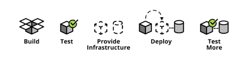
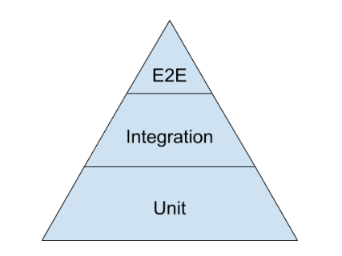
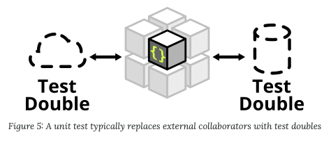

# 9장. 단위 테스트

## 테스트 코드의 중요성
1. 테스트 코드는 실수를 바로 잡아준다.
2. 실제 코드 못지 않게 중요하다.
3. 테스트 케이스는 변경이 쉽도록 한다.
   - 코드에 유연성, 유지보수성, 재사용성을 제공하는 버팀목이 바로 단위 테스트다.
   - 테스트 케이스가 없다면 모든 변경이 잠정적인 버그다.
   - 테스트 커버리지가 높을수록 버그에 대한 공포가 줄어든다.
4. 지저분한 테스트 코드는 테스트 안하니만 못하다.
---

## TDD 법칙 세 가지
- 첫째 법칙 : 실패하는 단위 테스트를 작성할 때까지 실제 코드를 작성하지 않는다.
- 둘째 법칙 : 컴파일은 실패하지 않으면서 실행이 실패하는 정도로만 단위 테스트를 작성한다.
- 셋째 법칙 : 현재 실패하는 테스트를 통과할 정도로만 실제 코드를 작성한다.

위 세가지 규칙을 따라 일을 하면, 실제 코드를 사실상 전부 테스트를하는 테스트 케이스가 나온다.<br>
하지만, <br>
실제 코드와 맞먹을 정도로 방대한 테스트 코드가 나와 심각한 관리 문제를 유발할 수도 있다.

---

## 깨끗한 테스트 코드 유지하기

테스트 코드가 복잡할수록 실제 코드를 짜는 시간보다 테스트 케이스를 추가하는 시간이 더 걸린다. <br>
왜냐하면, 실제코드가 변하면 테스크 코드도 변해야한다. 따라서 테스트코드가 지저분할수록 변경하기 어려워진다.
<br>

테스트 슈트가 없으면 시스템 이 쪽을 수정해도 저 쪽이 안전하다는 사실을 검증하지 못한다. <br>
그래서 결함율이 높아지고 변경하면 득보다 해가 크다는 생각해 더 이상 코드를 정리하지 않게되고, <br>
그로인해 코드가 망가진다.
<br>

따라서, 테스트 코드는 실제코드 못지않게 중요하다는 사실을 잊지 말아야한다.
그리고 테스트 코드는 유연성, 유지보수성, 재사용성을 제공한다

---

## 깨끗한 테스트 코드

깨끗한 코드를 작성하려면, 가독성이 중요하다. <br>
예시 코드를 통해서 알아보자.

### [개선 전 코드 : Bad Code]
```java
public void testGetPageHieratchyAsXml() throws Exception {
	crawler.addPage(root, PathParser.parse("PageOne"));
	crawler.addPage(root, PathParser.parse("PageOne.ChildOne"));
	crawler.addPage(root, PathParser.parse("PageTwo"));

	request.setResource("root");
	request.addInput("type", "pages");
	Responder responder = new SerializedPageResponder();
	SimpleResponse response =
		(SimpleResponse) responder.makeResponse(new FitNesseContext(root), request);
	String xml = response.getContent();

	assertEquals("text/xml", response.getContentType());
	assertSubString("<name>PageOne</name>", xml);
	assertSubString("<name>PageTwo</name>", xml);
	assertSubString("<name>ChildOne</name>", xml);
}

public void testGetPageHieratchyAsXmlDoesntContainSymbolicLinks() throws Exception {
	WikiPage pageOne = crawler.addPage(root, PathParser.parse("PageOne"));
	crawler.addPage(root, PathParser.parse("PageOne.ChildOne"));
	crawler.addPage(root, PathParser.parse("PageTwo"));

	PageData data = pageOne.getData();
	WikiPageProperties properties = data.getProperties();
	WikiPageProperty symLinks = properties.set(SymbolicPage.PROPERTY_NAME);
	symLinks.set("SymPage", "PageTwo");
	pageOne.commit(data);

	request.setResource("root");
	request.addInput("type", "pages");
	Responder responder = new SerializedPageResponder();
	SimpleResponse response =
		(SimpleResponse) responder.makeResponse(new FitNesseContext(root), request);
	String xml = response.getContent();

	assertEquals("text/xml", response.getContentType());
	assertSubString("<name>PageOne</name>", xml);
	assertSubString("<name>PageTwo</name>", xml);
	assertSubString("<name>ChildOne</name>", xml);
	assertNotSubString("SymPage", xml);
}

public void testGetDataAsHtml() throws Exception {
	crawler.addPage(root, PathParser.parse("TestPageOne"), "test page");

	request.setResource("TestPageOne"); request.addInput("type", "data");
	Responder responder = new SerializedPageResponder();
	SimpleResponse response =
		(SimpleResponse) responder.makeResponse(new FitNesseContext(root), request);
	String xml = response.getContent();

	assertEquals("text/xml", response.getContentType());
	assertSubString("test page", xml);
	assertSubString("<Test", xml);
}
```

### [개선 후 코드 : Refactoring]
```java
public void testGetPageHierarchyAsXml() throws Exception {
    // Build
	makePages("PageOne", "PageOne.ChildOne", "PageTwo");

    // Operate
	submitRequest("root", "type:pages");
    
    // Check
	assertResponseIsXML();
	assertResponseContains(
		"<name>PageOne</name>", "<name>PageTwo</name>", "<name>ChildOne</name>");
}

public void testSymbolicLinksAreNotInXmlPageHierarchy() throws Exception {
    // Build
	WikiPage page = makePage("PageOne");
	makePages("PageOne.ChildOne", "PageTwo");

    // Operate
	addLinkTo(page, "PageTwo", "SymPage");

	submitRequest("root", "type:pages");

    // Check
	assertResponseIsXML();
	assertResponseContains(
		"<name>PageOne</name>", "<name>PageTwo</name>", "<name>ChildOne</name>");
	assertResponseDoesNotContain("SymPage");
}

public void testGetDataAsXml() throws Exception {
    // Build
	makePageWithContent("TestPageOne", "test page");

    // Operate
	submitRequest("TestPageOne", "type:data");
    
    // Check
	assertResponseIsXML();
	assertResponseContains("test page", "<Test");
}
```

BUILD-OPERATE-CHECK 패턴이 위와 같은 테스트 구조에 적합하다. <br>
- BUILD : 테스트 자료를 만든다.
- OPERATE : 테스트 자료를 조작한다.
- CHECK : 조작한 결과가 올바른지 확인한다.

코드를 읽는 사람은 온갖 잡다하고 세세한 코드에 주눅들고 헷갈릴 필요 없이 코드가 수행하는 기능을 재빨리 이해할 수 있게 한다. <br>


### *도메인에 특화된 테스트 언어, DSL*

DSL 이란? : 도메인 특화 언어는 관련 특정 분야에 최적화된 프로그래밍 언어이다.

*도메인 특화 언어(DSL) 로 테스트 코드를 구현하는 기법*
- 시스템 조작 API 를 사용하는 대신 API 위에다 함수와 유틸리티를 구현한 후, 그 함수와 유틸리티를 사용한다.
- 구현한 함수와 유틸리티는 테스트 코드에서 사용하는 특수 API 가 된다.

### *이중 표준*
테스트 API 코드에 적용하는 표준은 실제 코드에 적용하는 표준과 확실히 다르다. 단순하고, 간결하고 표현력이 풍부해야 하지만, 실제 코드만큼 효율적일 필요는 없다. 실제 환경이 아니라 테스트 환경에서 돌아가는 코드이기 때문이다. 실제 환경과 테스트 환경은 요구사항이 판이하게 다르다.
<br>

---

## 테스트 당 assert 하나

assert 문을 단 하나인 함수를 작성하면 결론적으론 코드를 이해하기 쉽고 빠르다. <br>
또한, given-when-then 이라는 관례를 사용한다. 그러면 테스트 코드 읽기가 쉬워진다. <br>

given - when - then 패턴
- given : 테스트에 대한 Pre-condition
- when : 테스트하고 싶은 동작 호출
- then : 테스트 결과 확인


TEMPLATE METHOD 패턴을 사용하면 중복을 제거할 수 있다.
- given/when 부분을 부모클래스에 두고 then 부분을 자식 클래스에 두기
- 완전히 독자적인 테스트 클래스를 만들어 @Before 함수에 given/when 부분을 넣고 @Test 함수에 then 부분을 넣기

하지만, <br>
이것저것 감안해 보면 결국 assert 문을 여럿 사용하는 편이 좋지만, 그래도 단일 assert 문이 라는 규칙이 훌륭한 지침이라 생각한다.<br>
즉, assert 문 개수는 최대한 줄여야 좋다.

### *테스트 당 개념 하나*
```java
/**
 * addMonth() 메서드를 테스트하는 장황한 코드
 */
public void testAddMonths() {
    SerialDate d1 = SerialDate.createInstance(31, 5, 2004);

    SerialDate d2 = SerialDate.addMonths(1, d1); 
    assertEquals(30, d2.getDayOfMonth()); 
    assertEquals(6, d2.getMonth()); 
    assertEquals(2004, d2.getYYYY());
  
    SerialDate d3 = SerialDate.addMonths(2, d1); 
    assertEquals(31, d3.getDayOfMonth()); 
    assertEquals(7, d3.getMonth()); 
    assertEquals(2004, d3.getYYYY());
  
    SerialDate d4 = SerialDate.addMonths(1, SerialDate.addMonths(1, d1)); 
    assertEquals(30, d4.getDayOfMonth());
    assertEquals(7, d4.getMonth());
    assertEquals(2004, d4.getYYYY());
}
```
위 코드처럼, assert 문이 여럿이라는 사실은 문제가 아니다. <br>
한 테스트 함수에서 여러 개념을 테스트한다는 사실이 문제다. <br>
그러므로, 
가장 좋은 규칙 
- "개념 당 assert 문 수를 최소로 줄여라." 
- "테스트 함수 하나는 개념 하나만 테스트하라"
이다.

---

## F.I.R.S.T

깨끗한 테스트는 다음 다섯 가지 규칙을 따른다.
- **테스트는 빨라야한다(Fast)** : 테스트가 느리면 자주 돌릴 엄두도 못내고, 그렇다보면 초반에 문제를 찾아내질 못해 훗날 코드 정리도 힘들어지고 코드 품질이 망가진다.


- **테스트는 서로 의존하면 안된다(Independent)** : 서로 의존하면 하나가 실패할 때, 나머지도 잇달아 실패하므로 원인 진단하기 어려워지며 후반 테스트가 찾아내야 할 결함이 숨겨진다.


- **테스트는 어떤 환경에서도 반복 가능해야 한다(Repeatable)** : 테스트가 돌아가지 않는 환경이 하나라도 있다면, 테스트가 실패한 이유를 둘러댈 변명이 생겨 훗날 환경이 지원되지 않기에 테스트 수행을 못하게 된다.


- **테스트는 부울(bool) 값으로 결과를 내야한다(Self-Validating)** : 성공 아니면 실패다. 통과 여부를 알기위해 로그 파일을 읽게 만들어선 안된다. 테스트가 스스로 성공 실패를 가늠하지 않는다면 판단은 주관적이게 되며, 수작업 평가가 필요하게 된다.


- **테스트는 적시에 해야한다(Timely)** : 실제 코드를 구현한 다음에 테스트 코드를 만들면 실제 코드가 테스트하기 어렵다는 사실을 발견하게 될 수도 있다. 따라서 테스트가 불가능하도록 실제 코드를 설계할지도 모른다.

---


## 결론
- 테스트 코드는 실제만큼이나 프로젝트 건강에 중요하다.
- 테스트 코드는 실제 코드의 유연성, 유지보수성, 재사용성을 보존하고 강화한다.
- 따라서, 테스트 코드는 지속적으로 깨끗하게 관리하고, 표현력을 높이고 간결하게 정리하자.
- 테스트 API 를 구현해도 도메인 특화 언어를 만들자.

----


## [추가] 단위테스트에 대해서


### *테스트는 자동화 되어야 한다.*



개발자가 코드를 작성하고, 양심껏 테스트 코드를 작성해서 테스트를 실행해보는 게 아니라. <br>
실제 배포하기 전에, 테스트를 실행하도록 자동화를 시켜놓아야 한다.. <br>

<br>


### *구글이 제안하는 테스트 종류*


- 70% unit tests : 프로그램 내부의 개별 컴포넌트의 동작을 테스트한다. 배포하기 전에 자동으로 실행되도록 많이 사용한다.
- 20% integration tests : 프로그램 내부의 개별 컴포넌트들을 합쳐서 동작을 테스트한다. unit test 는 각 컴포넌트를 고립시켜 테스트 하기 때문에 컴포넌트의 interaction 을 확인하는 integration test 가 필요하다.
- 10% end-to-end tests : 실제 유저의 시나리오대로 네트워크를 통해 서버의 Endpoint 를 호출해 테스트한다.

[Unit Test 참고 (구글블로그)](https://testing.googleblog.com/2015/04)

### *테스트 라이브러리를 사용하자*

유닛테스트를 작성할 때, 라이브러리를 사용해서 구현하는 게 좋다.<br>
실제로 모든 Mock 을 만들거나 모든 기능을 구현할 수 없기 때문에 라이브러리를 사용하는 것이 좋다.

테스트 라이브러리 종류
- JUnit
- Mockito
- Wiremock
- Pact
- Selenium
- REST-assured

실무에선 JUnit5 와 Mockito 를 가장 많이 사용한다.

### *Test Double*
테스트에서 원본 객체를 대신하는 객체를 Test Double 이라 한다.


Test Double 종류

*Stub*
- 원래의 구현을 최대한 단순한 것으로 대체한다.
- 테스트를 위해 프로그래밍된 항목에만 응답한다.

*Spy*
- Stub 의 역할을 하면서 호출에 대한 정보를 기록한다.
- 이메일 서비스에서 메시지가 몇 번 전송 되었는 지 확인 할 때 사용하면 좋다.

*Mock*
- 행위를 검증하기 위해 가짜 객체를 만들어 테스트하는 방법
- 호출에 대한 동작을 프로그래밍할 수 있다.
- Stub 은 상태를 검증하고 Mock 은 행위를 검증한다.


[Unit Test 참고 (martinfowler 링크)](https://martinfowler.com/articles/practical-test-pyramid.html)


